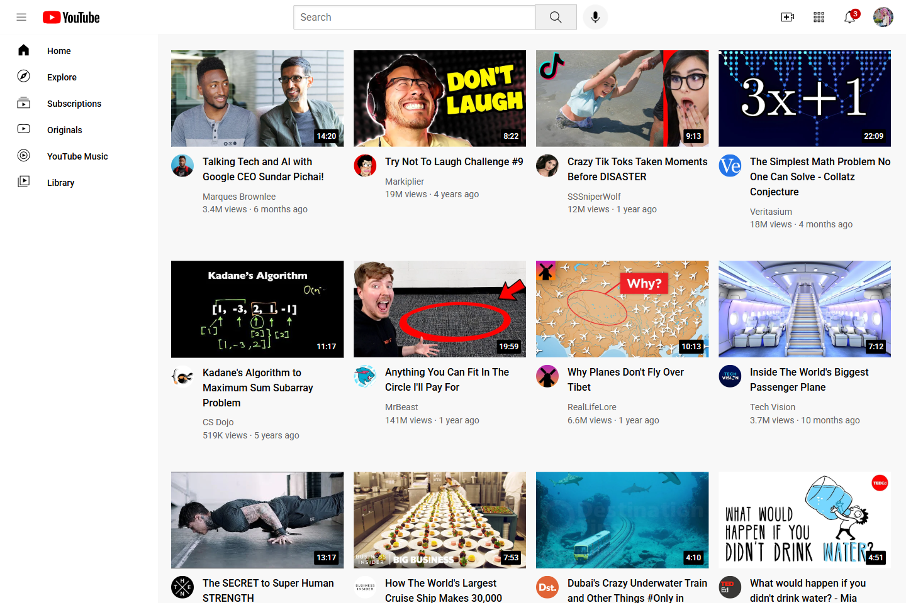

# YouTube Clone Website

## A YouTube Clone Landing Page

| _Mobile Preview (375x812)_                       | _Desktop Preview (1440x960)_                        |
| ------------------------------------------------ | --------------------------------------------------- |
|  |  |

A responsive clone of YouTube's homepage UI layout created using semantic HTML and pure CSS. This project was built to replicate a real-world platform interface and practice multi-section structuring, responsiveness, and visual hierarchy.

---

## Overview

This project is a static clone of YouTube’s homepage interface, built entirely with semantic HTML and custom CSS. The layout includes a sticky header, sidebar navigation, responsive video grid, and tooltips which are all crafted without using JavaScript.

The goal of this build was to practice real-world UI replication while applying responsive design techniques, Flexbox, and CSS Grid. It also reinforced clean class structuring, hover interactions, and layout adaptability for multiple screen sizes.

---

## Features

- Multi-section layout mimicking YouTube UI
- Created a search bar and icon buttons with tooltip hovers
- Responsive grid for video previews (1–4 columns depending on screen size)
- Channel info tooltip on hover over profile icons
- Sticky header and sidebar navigation
- Sidebar transforms based on screen width (mobile-friendly)
- Clean styling using utility classes and consistent font management
- Semantic HTML for accessibility and structure

---

## What I Learned

- How to structure large UI layouts with semantic HTML
- Building fully responsive grid systems with CSS Grid and Flexbox
- Controlling visibility and interaction states with `:hover` and `opacity`
- Working with `position: absolute` and `relative` for floating elements
- Designing adaptive layouts with media queries
- Creating reusable class naming systems and modular CSS

---

## Tech Used

- HTML5
- CSS3
- Git
- GitHub
- Netlify

---

## How to Run

1. Clone the repository
2. Open `index.html` in your browser

---

## Live Demo

Or you can check out the **[live website here](https://youtube-clone-jiro.netlify.app/)**

---

## Author

Created by **Elmar Chavez**

Month/Year: **May 2025**

Journey: **2nd** month of learning _frontend web development_.
